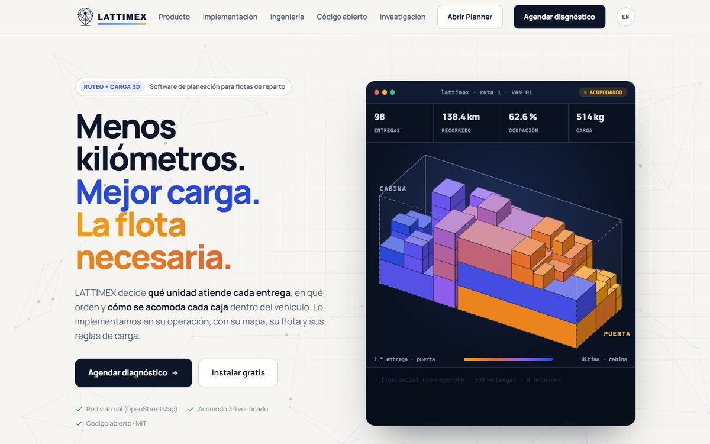
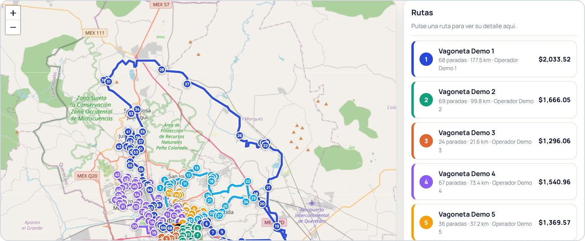
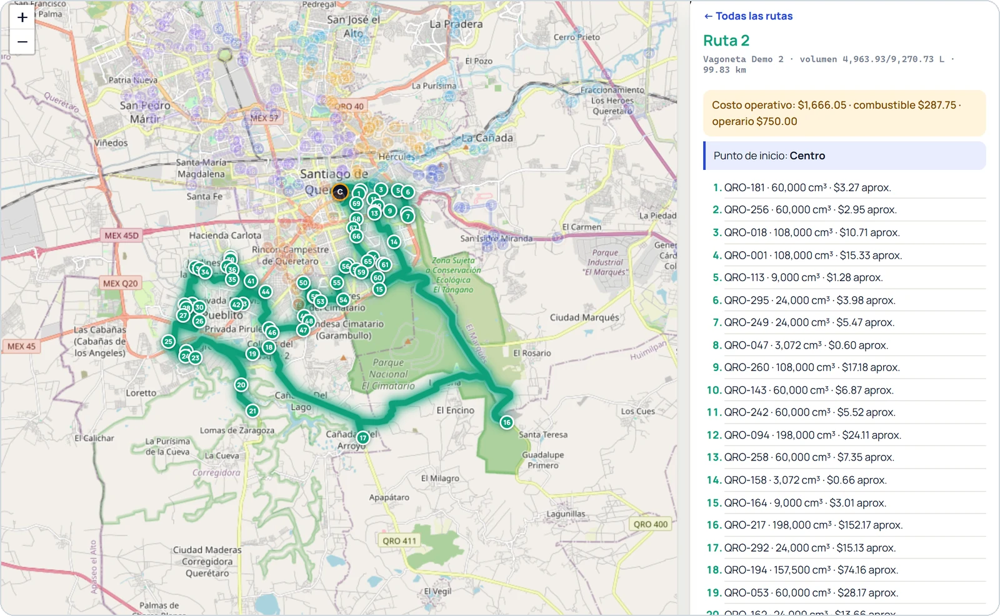
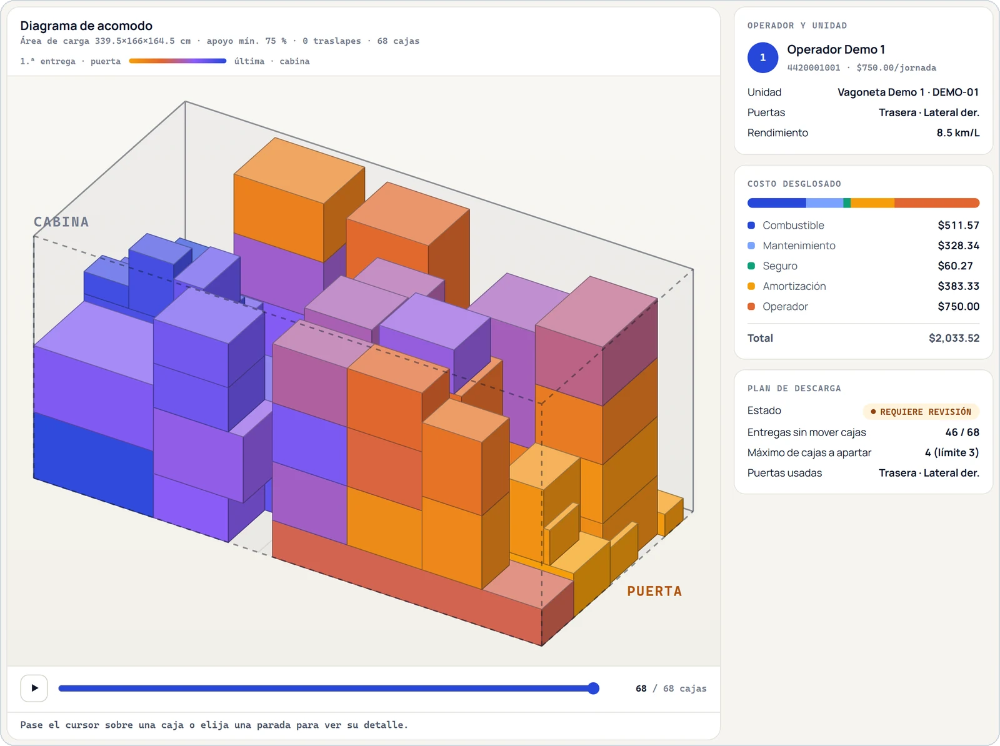
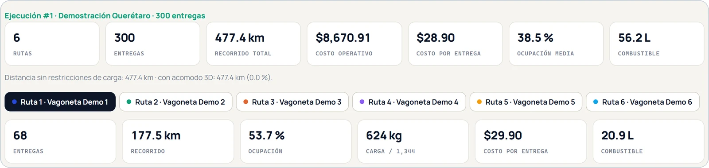
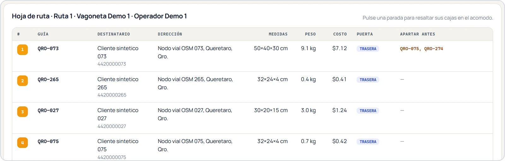
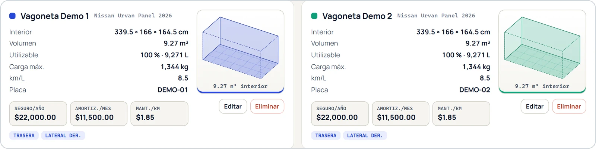
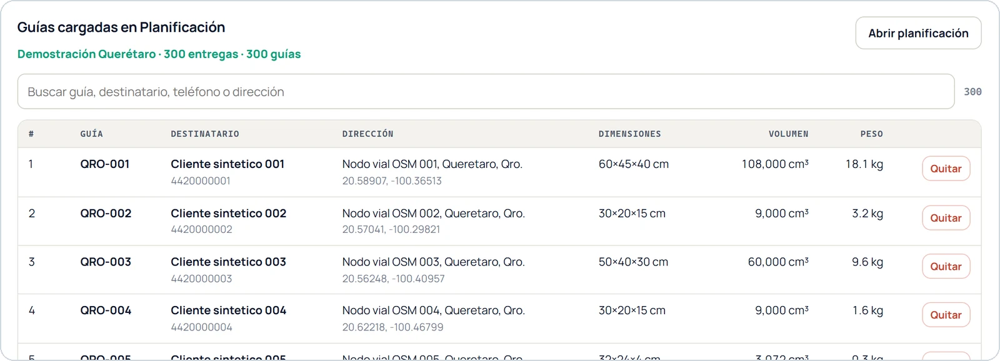

# LATTIMEX

**Vehicle routing with 3D load placement, on your own computer.**

[Español](README.md) · English

[](LICENSE)
[](https://lattimex.com)
[](https://lattimex.com/planner)

LATTIMEX decides which vehicle serves each delivery, in what order, and where every box goes inside
the vehicle, on the real road network of your city. This repository contains the **optimization
engine**, the **local server** and the **map builder**. The graphical interface is the
[LATTIMEX Planner](https://lattimex.com/planner), which opens in the browser and works with the
engine you run yourself: **your data never leaves your computer**.

[](https://lattimex.com)

<p align="center"><a href="https://lattimex.com"><b>Discover LATTIMEX at lattimex.com →</b></a></p>

## Try it in five minutes

Requirements: Python 3.10 or later and a C++ compiler (g++ or clang++). On Windows without a
compiler, `pip install ziglang` installs a portable one that LATTIMEX picks up automatically (clone
into a short path such as `C:\lattimex`: `ziglang` fails with paths longer than 260 characters).

```bash
git clone https://github.com/Erick-MF28/lattimex.git
cd lattimex
pip install -r requirements.txt        # Windows without a compiler: pip install ziglang
python -m lattimex build               # compiles the engine and the 3D packer
python -m lattimex map --bbox 20.47,-100.52,20.82,-100.22 --name queretaro
python -m lattimex serve               # http://127.0.0.1:8765
```

Open **https://lattimex.com/planner** in Chrome, Edge or Firefox. The first time, the browser asks
for permission to access services on this device: accept it. In **Guías** (shipments), the
**Cargar ejemplo** button adds 300 synthetic deliveries in Querétaro, six vans and five drivers; in
**Planificación** (planning), a single button, **Optimizar**, computes the routes and the placement
of every box. The Planner interface is currently in Spanish.

**Your data stays where you decide.** Fleet, shipments, instances and runs are stored in
`data/lattimex.sqlite3`; if you close the Planner, your last operation is there when you come back,
and shipments you captured but had not saved yet are recovered automatically. To work with another
folder (for example, one per customer or a shared network folder):

```bash
python -m lattimex serve --data D:\operations\customer_a
```

`python -m lattimex doctor` checks the installation and `python -m lattimex probe` prints the
engine's deterministic fingerprint. It depends on the C++ standard library used to build it:
`6457b2dd44660773` with zig/libc++ (the Windows installer and `pip install ziglang`) and
`285bf1758e5dd6a1` with g++/libstdc++ (Linux and MinGW). If your build gives the fingerprint of its
library, it computes exactly what the published engine computes.

**Rather not use the terminal?** `python -m lattimex app` opens a window that starts the engine,
prepares your city map and opens the Planner. The same window is packaged as a Windows application
with an installer and no prerequisites: see [packaging/windows](packaging/windows/README.md).

## What it looks like

Planner screenshots with the bundled example: 300 deliveries in Querétaro, six vans and five
drivers.

**Routes on real streets.** One color per route on the
[OpenStreetMap](https://www.openstreetmap.org/copyright) map and, on the right, each vehicle with its
stops, kilometers, driver and cost.



**One route at a time.** Selecting a route frames it on the map; the panel shows its cost breakdown
and the sequence of stops.



**3D load placement.** Every box inside the vehicle, from the cab to the door in reverse delivery
order, together with the driver, the cost breakdown and the unloading plan.



**Indicators for the whole run and for each route.**



**Route sheet for the driver**, with dimensions, weight, cost per delivery, unloading door and which
boxes to set aside first.



**Fleet and shipments.** Interior dimensions, doors, maximum load and costs of each vehicle;
shipments entered by hand, from CSV or with the example.





Map data in the screenshots: © [OpenStreetMap contributors](https://www.openstreetmap.org/copyright),
available under ODbL 1.0.

## How it works

```text
 lattimex.com/planner  ──(interface only)──►  browser
                                                │  http://127.0.0.1:8765
                                                ▼
                         ┌───────────── your computer ─────────────┐
                         │  local server  →  SENDA (C++)           │
                         │  SQLite store  →  3D packer (C++)       │
                         │  own map       →  verifier              │
                         └─────────────────────────────────────────┘
```

1. **Own map.** `python -m lattimex map` builds, once, the road graph of your city from
   OpenStreetMap. Distances and routes are computed on real streets, without external services.
2. **Routing.** The routing core, SENDA (*Single-trajectory ENgine with Destroy-and-repair Adaptive
   search*), follows a single search trajectory per run, with no population and no crossover: it
   builds routes, improves them with granular local search and restructures them with an adaptive
   large neighborhood search (ALNS) with adaptive capacity penalties, in a portfolio of four runs in
   parallel.
3. **3D loading.** A C++ packer places each box respecting support, fragility, orientation and the
   unloading order by door; if something does not fit, a mediator readjusts the routes with the
   fixed fleet.
4. **Verification.** An independent verifier rechecks distances, capacity, coverage and the geometry
   of every box before the plan is delivered.

Details in [docs/en/ARCHITECTURE.md](docs/en/ARCHITECTURE.md), [docs/en/MAPS.md](docs/en/MAPS.md) and
[docs/en/SECURITY.md](docs/en/SECURITY.md).

## Learn how the engine works

The educational guide [**paper/senda_guide_en.pdf**](paper/senda_guide_en.pdf) explains from
scratch, with worked examples, every component of SENDA, its computational complexity, how it was
evaluated against reference solvers from the literature and which evaluation mistakes to avoid. It
ends with a section for repeating the measurements on your computer. The Spanish original is
[paper/guia_senda.pdf](paper/guia_senda.pdf). The programs used for comparison are not part of this
repository; notes and references are in [docs/en/ACADEMIC_NOTES.md](docs/en/ACADEMIC_NOTES.md).

## What is in this repository

| Folder | Contents |
|---|---|
| `native/` | SENDA, the routing core (`senda_core.cpp`: single-trajectory ALNS per run with adaptive penalties and a parallel portfolio), and the 3D packer (`pack3d.cpp`) |
| `lattimex/engine/` | Engine pipeline: effective capacity, 3D packing, fixed-fleet mediation, unloading plan by door |
| `lattimex/server.py` | Local server for the Planner (listens on 127.0.0.1 only) |
| `lattimex/maps.py` | Builds your own map from OpenStreetMap |
| `tests/` | Engine tests, C++/Python equivalence of the packer and server tests |
| `paper/` | Educational guide, in Spanish and English (LaTeX and PDF) |
| `packaging/windows/` | Windows application and installer (start window, no terminal) |
| `docs/` | Architecture, Planner connection, security, maps, local API and academic notes (`docs/en/` in English) |

Source code identifiers and comments are mostly in Spanish.

## Tests

```bash
python -m unittest discover -s tests/engine        # 42 engine tests
python -m unittest tests.test_local_api -v         # full flow and server defenses
python tests/native/test_pack3d_equivalencia.py    # 72 cases: C++ identical to Python (~10 min)
python -m lattimex probe                           # deterministic engine fingerprint
```

## Licenses

- **Engine, local server and map builder:** [MIT](LICENSE). You may use, modify and distribute them,
  including commercially, keeping the copyright and license notices.
- **LATTIMEX Planner** (lattimex.com/planner): free to use; it is not distributed in this repository
  and may not be redistributed or commercially exploited by third parties. See
  [its license](https://lattimex.com/planner/licencia.html).
- **Educational guide** (`paper/`): [CC BY 4.0](https://creativecommons.org/licenses/by/4.0/). You may
  share and adapt it, including commercially, citing the source ([CITATION.cff](CITATION.cff)),
  linking the license and indicating the changes made.
- **Street data:** © OpenStreetMap contributors, [ODbL 1.0](https://opendatacommons.org/licenses/odbl/).
- **Trademark:** "LATTIMEX" and its logo are not covered by the MIT license. See [NOTICE](NOTICE).
- Dependencies: see [docs/en/THIRD_PARTY_LICENSES.md](docs/en/THIRD_PARTY_LICENSES.md). Code
  provenance: [docs/en/AUTHORSHIP.md](docs/en/AUTHORSHIP.md). Changes:
  [docs/en/CHANGELOG.md](docs/en/CHANGELOG.md).

## Implementation services

The engine is offered free of charge under MIT. Implementation, configuration, integration and
training services are quoted separately.

Would you rather have us install it and integrate it with your operation (map, fleet, loading rules,
ERP/WMS/TMS, training)? Visit [lattimex.com](https://lattimex.com) or write to
**contacto@lattimex.com**.

## Donations

The LATTIMEX engine is free and open source. If the engine, the guide or the Planner are useful to
you, you can support their development with a donation: every contribution funds maintenance, new
cities and more educational material.

<p align="center"><a href="https://www.paypal.com/donate/?hosted_button_id=ZAAQQDBG2C4ZE"><b>♥ Donate to LATTIMEX with PayPal</b></a></p>

One-time, monthly or yearly donations, by card or PayPal account.

Would your company like to sponsor a feature or an integration? Write to contacto@lattimex.com.
